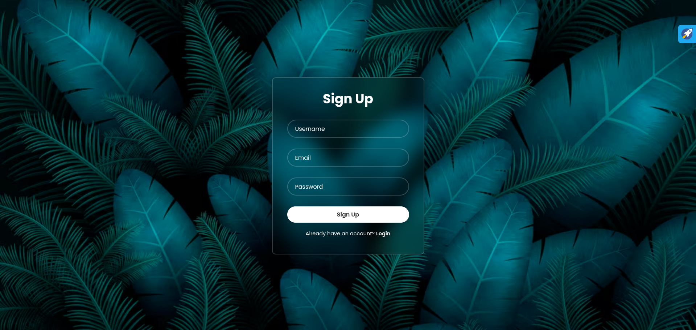
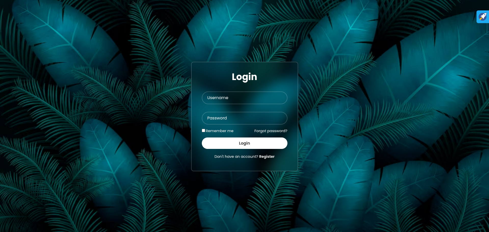

# 🔐 Signup & Login Page

A simple and responsive **Signup & Login Page** created using **HTML** and **CSS**. This project is perfect for beginners who want to understand the basic structure of user authentication UIs.

> Clean UI. Mobile responsive. Easy to integrate.

---

## 🚀 Demo

🔗 [Live Demo](https://amitkumarraikwar.github.io/signup-login-page/)  
📂 [View Source Code](https://github.com/amitkumarraikwar/signup-login-page)

---

## 📸 Screenshots

| Signup Page | Login Page |
|-------------|------------|
|  |  |

> 

---

## 💪 Built With

- HTML5 🧱  
- CSS3 🎨  
- Responsive Design 🖥️📱

---

## 📁 Folder Structure

```
signup-login-page/
│
├── index.html       # Login Page
├── signup.html      # Signup Page
├── style.css        # Styling
└── README.md        # You’re reading it 👀
```

---

## 💡 Features

- Clean and minimal UI
- Fully responsive
- Modern design
- Easy to customize

---

## 🔧 How to Use

1. Clone the repo:
   ```bash
   git clone https://github.com/amitkumarraikwar/signup-login-page.git
   ```

2. Open the files in your browser:
   - `signup.html` for the Signup page
   - `index.html` for the Login page

---

## 🌐 Connect with Me

- GitHub: [@amitkumarraikwar](https://github.com/amitkumarraikwar)
- LinkedIn: [Amit Kumar Raikwar](https://www.linkedin.com/in/amitkumarraikwar)
- Portfolio: [amitkumarraikwar.in](https://amitkumarraikwar.in)

---

## 📃 License

This project is open-source and available under the [MIT License](LICENSE).

---

## 💭 Feedback & Contributions

Found a bug or have a feature request? Feel free to [open an issue](https://github.com/amitkumarraikwar/signup-login-page/issues) or fork and submit a pull request!

---

⭐ Don’t forget to star this repo if you found it helpful!

